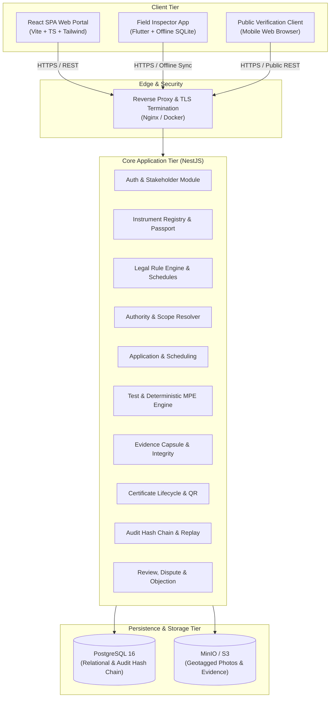
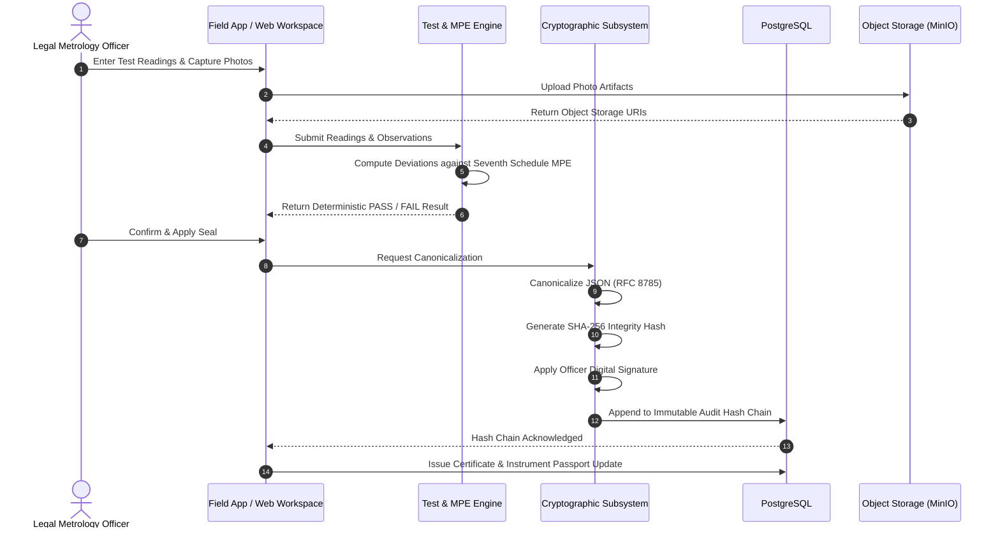
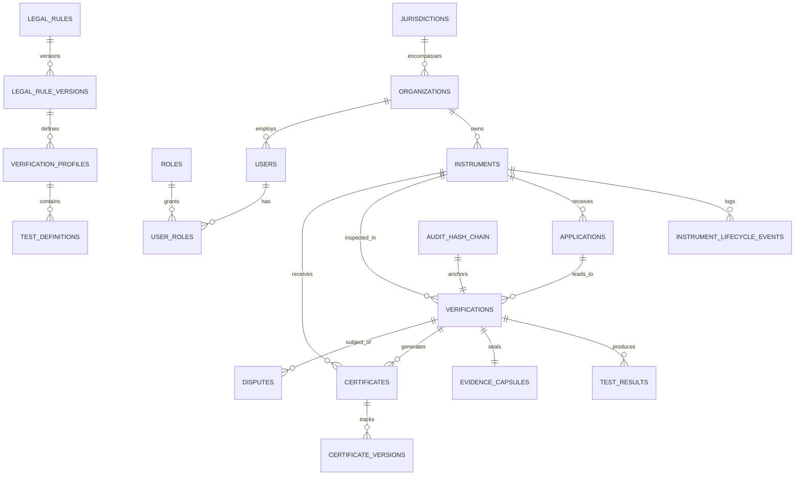

# PERIMETER: System Architecture & Technical Specification
## Architectural Blueprint & Technical Source of Truth

---

### Document Control
- **Document ID**: ARCH-PERIMETER-2026-V1.0
- **Version**: 1.0.0
- **Status**: APPROVED ARCHITECTURAL BASELINE
- **Author**: Principal Software Architect & Systems Analyst

---

### 1. System Context & High-Level Topology

PERIMETER is organized as a high-integrity, modular client-server ecosystem designed to provide verifiable, tamper-evident lifecycles for Legal Metrology instruments across India.



---

### 2. Architectural Principles

1. **Deterministic Legal Correctness**: Legal rules, tolerances (MPE), and validity intervals are derived mathematically from versioned legal schedules, never from hardcoded frontend values.
2. **Cryptographic Traceability**: Integrity is maintained via RFC 8785 canonical JSON serialization, real SHA-256 digests, digital signature containers, and an unbroken audit hash chain.
3. **Zero Trust Client Execution**: The web frontend and mobile client are untrusted presentation layers. All authorization (RBAC/ABAC), validation, state progression, and calculation occur server-side.
4. **Persistent Digital Identity**: The Instrument Passport is persistent across the instrument's physical lifespan, regardless of ownership shifts, repair cycles, or re-verifications.
5. **Privacy-Preserving Public Trust**: Public verification exposed via QR codes verifies instrument authenticity without leaking personal phone numbers, applicant financial records, or internal officer data.
6. **Reconstructable Auditing ("Verification Replay")**: A supervisor or court must be able to reconstruct the exact legal rule, reference standard, inspector, raw inputs, and MPE limits that produced any historical certificate.

---

### 3. Modular Logical Architecture

```
                    ┌──────────────────────────────────────────────┐
                    │            PERIMETER Core Platform           │
                    └──────────────────────┬───────────────────────┘
                                           │
         ┌─────────────────────────────────┼─────────────────────────────────┐
         ▼                                 ▼                                 ▼
┌──────────────────┐             ┌──────────────────┐             ┌──────────────────┐
│ Instrument Core  │             │ Legal & Decision │             │ Trust & Security │
├──────────────────┤             ├──────────────────┤             ├──────────────────┤
│ - Registry       │             │ - Rule Engine    │             │ - Canonicalizer  │
│ - Legacy Onboard │             │ - Scope Resolver │             │ - SHA-256 Digest │
│ - Life Events    │             │ - MPE Calculator │             │ - Digital Sig    │
│ - Physical Seals │             │ - Test Profiles  │             │ - Hash Chain     │
└──────────────────┘             └──────────────────┘             └──────────────────┘
         │                                 │                                 │
         └─────────────────────────────────┼─────────────────────────────────┘
                                           │
         ┌─────────────────────────────────┼─────────────────────────────────┐
         ▼                                 ▼                                 ▼
┌──────────────────┐             ┌──────────────────┐             ┌──────────────────┐
│ Lifecycle & Cert │             │ Governance       │             │ Observability    │
├──────────────────┤             ├──────────────────┤             ├──────────────────┤
│ - Certificates   │             │ - Objections     │             │ - Real-time Logs │
│ - Revocations    │             │ - Replay Engine  │             │ - Dashboards     │
│ - QR Generator   │             │ - Evidence Lock  │             │ - State Metrics  │
│ - Public Portal  │             │ - Appeals        │             │ - Notifications  │
└──────────────────┘             └──────────────────┘             └──────────────────┘
```

---

### 4. Subsystem Deep Dives

#### 4.1 Legal Rule Engine & Authority Resolver Subsystem
The Legal Rule Engine eliminates hardcoded assumptions by evaluating versioned rule sets against the date of inspection.
- **Rule Hierarchy**: Legal Metrology Act, 2009 > Legal Metrology (General) Rules, 2011 (with Amendments) > State Enforcement Rules.
- **Rule Status Lifecycle**:
  - `FUTURE`: Rule is gazetted but effective date is in the future (e.g., 2026 5th Amendment transition period). Blocked from active calculation.
  - `ACTIVE`: Current statutory law.
  - `SUPERSEDED`: Historical rule valid for verifications performed within its historical window, essential for audit replay.
- **Authority Resolver**: Evaluates whether an application falls under:
  - Exclusive LMO jurisdiction (e.g., commercial market enforcement, seized instruments, initial legal seizures).
  - GATC-eligible jurisdiction (instruments within specific accredited schedules, e.g., high-precision laboratory balances, flow meters under certified GATC scope).

#### 4.2 Guided Inspection & Test Engine Subsystem
When an officer starts an inspection:
1. System queries the **Verification Profile** mapped to the instrument category and capacity (e.g., *Non-Automatic Weighing Instruments - Class III, Max 30 kg, e=5g*).
2. Generates test steps:
   - Visual & Physical Examination (nameplate integrity, leveling, seal seating).
   - Reference Standard Equipment Verification (serial #, calibration cert validity).
   - Zero Load Error Test ($E_0$).
   - Eccentricity Test (1/3 Max at 4 corners and center).
   - Increasing & Decreasing Load Test (minimum 5 points: Min, 500e, 2000e, Max).
   - Repeatability Test (3 runs at 1/2 Max and Max).
3. The engine evaluates:
   $$E = I + 0.5e - \Delta L - L$$
   $$\text{MPE Allowance per Seventh Schedule:}$$
   $$\text{For } 0 \le m \le 500e \implies \pm 0.5e$$
   $$\text{For } 500e < m \le 2000e \implies \pm 1.0e$$
   $$\text{For } 2000e < m \le \text{Max} \implies \pm 1.5e$$
   *(Double MPE tolerance for service verification where specified by rule)*.

#### 4.3 Evidence Capsule & Cryptographic Integrity Subsystem
To guarantee evidential integrity in statutory proceedings:
1. **Evidence Gathering**: GPS latitude/longitude, UTC ISO timestamp, device hardware ID, raw readings array, photo hashes, and officer employee ID.
2. **Canonical JSON Serialization (RFC 8785)**: Keys sorted lexicographically, whitespace normalized, floats formatted deterministically.
3. **SHA-256 Digest**:
   $$\text{Digest} = \text{SHA256}(\text{CanonicalJSON}(\text{EvidenceCapsule}))$$
4. **Digital Signature**: Authorized officer’s cryptographic key signs the digest (Ed25519 or RSA-PSS).
5. **Audit Hash Chain**:
   $$\text{BlockHash}_n = \text{SHA256}(\text{EventData}_n \,||\, \text{BlockHash}_{n-1})$$



#### 4.4 Certificate Lifecycle & Public Verification Subsystem
Certificates undergo explicit state transitions:
- `DRAFT` $\to$ `ISSUED` (Valid) $\to$ `EXPIRED` (upon statutory date passed)
- `ISSUED` $\to$ `SUPERSEDED` (upon re-verification)
- `ISSUED` $\to$ `SUSPENDED` (upon compliance notice or pending investigation)
- `ISSUED` $\to$ `REVOKED` (upon detected tampering or statutory cancellation)

Public QR code URL format:
`https://verify.legalmetrology.gov.in/v/{certificate_public_id}`
Returns privacy-masked metadata verified against server-side integrity records.

#### 4.5 Dispute, Independent Review & Verification Replay
When a merchant or manufacturer disputes a rejection:
1. System transitions the verification into `LOCKED_DISPUTED`. No retrospective data alterations permitted.
2. An Appellate Authority / Supervisory Controller opens the **Verification Replay Console**.
3. The Replay Engine loads the exact rule version active at the inspection timestamp, feeds the recorded test observations back through the MPE Engine, and confirms whether the mathematical PASS/FAIL was correct.
4. Photos, GPS metadata, and reference standard records are reviewed for procedural fidelity.

---

### 5. Target Database Architecture (PostgreSQL Schema)



#### Core Entities Specification (Phase 1 & Phase 2 Baseline Implemented)
1. **`users`** (`IMPLEMENTED`): `id (UUID)`, `email`, `password_hash` (bcrypt work factor 12), `full_name`, `phone`, `designation`, `employee_id`, `organization_id`, `jurisdiction_id`, `status` (`ACTIVE`, `SUSPENDED`, `DISABLED`, `PENDING`), `refresh_token_hash` (SHA-256 digest), `last_login_at`, timestamps.
2. **`roles` & `permissions`** (`IMPLEMENTED`): `id (UUID)`, `name` (`ADMIN`, `LMO`, `GATC`, `BUSINESS`, `PUBLIC`), `role_permissions`, `user_roles`. 9 core permissions seeded and mapped.
3. **`jurisdictions`** (`IMPLEMENTED`): `id (UUID)`, `state_code`, `state_name`, `district_code`, `district_name`, `tehsil`, `pin_codes`, `is_active`, timestamps.
4. **`organizations`** (`IMPLEMENTED`): `id (UUID)`, `name`, `type` (`BUSINESS`, `GATC`, `LMO_OFFICE`, `CONTROLLER_HQ`), `registration_number`, `jurisdiction_id`, `gatc_scope_metadata (JSONB)`, `is_active`, timestamps.
5. **`instrument_models`** (`IMPLEMENTED`): `id (UUID)`, `model_name`, `manufacturer`, `model_approval_ref`, `accuracy_class`, `max_capacity`, `capacity_unit`, `verification_interval_e`, `applicable_schedule`, `is_active`, timestamps.
6. **`instruments`** (`IMPLEMENTED`): `id (UUID)`, `passport_number`, `is_provisional`, `provisional_id`, `category`, `instrument_type`, `serial_number`, `model_id`, `capacity`, `unit`, `accuracy_class`, `owner_org_id`, `jurisdiction_id`, `current_status`, `physical_address`, `gps_latitude`, `gps_longitude`, `current_lead_seal_number`, timestamps.
7. **`legal_sources`** (`IMPLEMENTED`): `id (UUID)`, `source_code`, `filename`, `title`, `document_type`, `notification_number`, `publication_date`, `status`, `page_count`, timestamps.
8. **`legal_rule_versions`** (`IMPLEMENTED`): `id (UUID)`, `rule_code`, `source_id`, `rule_number`, `schedule_number`, `part_number`, `instrument_category`, `status`, `effective_from`, `validity_period_months`, `requirement_summary`, `mpe_formula_spec (JSONB)`, timestamps.
9. **`verifications`** (`PLANNED - Phase 5/10`): Application reference, inspector reference, overall result, seal number, canonical digest, digital signature.
10. **`evidence_capsules`** (`PLANNED - Phase 12`): Raw canonical payload, SHA-256 hash, photo metadata, GPS fix.
11. **`certificates`** (`PLANNED - Phase 14`): Certificate number, validity dates, QR slug, security hash.
12. **`audit_hash_chain`** (`PLANNED - Phase 13`): Sequence number, actor ID, payload hash, previous and current block hashes.

---

### 6. API Boundaries & Routing Structure

Base URL: `/api/v1`

| Route Prefix | Domain | Description | Status |
| :--- | :--- | :--- | :--- |
| `/auth` | Authentication & RBAC | `POST /register`, `POST /login`, `POST /refresh`, `GET /me`. JwtAuthGuard, RolesGuard (`ADMIN`, `LMO`, `GATC`, `BUSINESS`, `PUBLIC`). | **IMPLEMENTED** |
| `/users` | Stakeholder Management | User accounts, designations, credentials. |
| `/jurisdictions` | Regional Boundaries | State, district, and jurisdictional coverage mapping. |
| `/instruments` | Instrument Registry | Passport CRUD, legacy onboarding, seal history, lifecycle events. |
| `/rules` | Legal Rule Engine | Versioned schedules, effective dates, MPE profiles, validation rules. |
| `/applications` | Workflow | Application submission, document uploads, status tracking. |
| `/assignments` | Authority Resolver | Scheduling, LMO vs GATC scope assignment, appointment slots. |
| `/verifications` | Guided Inspection | Active inspection session, test observation logging, MPE evaluation. |
| `/evidence` | Evidence Subsystem | Photo uploads, GPS telemetry validation, capsule serialization. |
| `/certificates` | Certificate Engine | Issuance, versioning, revocation, PDF generation. |
| `/public/verify` | Consumer Trust | Privacy-masked public verification by QR/slug. Non-authenticated. |
| `/disputes` | Governance & Review | Dispute filing, evidence locking, supervisor verification replay. |
| `/audit` | Audit & Integrity | Audit hash chain validation, tamper-detection checks. |
| `/reports` | Analytics | Compliance metrics, regional performance, officer workload. |

---

### 7. Deployment & Infrastructure Architecture

```
                  ┌──────────────────────────────┐
                  │    Internet / External DNS   │
                  └──────────────┬───────────────┘
                                 │
                   ┌─────────────▼─────────────┐
                   │  Reverse Proxy / Nginx    │
                   │  TLS 1.3, Rate Limiting   │
                   └─────────────┬─────────────┘
                                 │
            ┌────────────────────┼────────────────────┐
            ▼                                         ▼
┌────────────────────────┐               ┌────────────────────────┐
│  React Web Application │               │ NestJS API Application │
│  (Static Nginx Host)   │               │ (Node.js Container)    │
└────────────────────────┘               └───────────┬────────────┘
                                                     │
                                 ┌───────────────────┼───────────────────┐
                                 ▼                                       ▼
                    ┌────────────────────────┐              ┌────────────────────────┐
                    │ PostgreSQL 16 Database │              │ MinIO Object Storage   │
                    │ Primary + Read Replica │              │ Local S3-Compatible    │
                    └────────────────────────┘              └────────────────────────┘
```
- **Containerization (DECLARED / CONFIGURED)**: `docker-compose.yml` configures `postgres:16-alpine` and pinned `minio/minio:RELEASE.2024-11-07T00-52-28Z` for unified staging and production deployment.
- **Physical Validation Environment (HOST POSTGRESQL 16)**: For Phase 1 engineering, automated tests, migration execution, and `/api/v1/health` checks were validated against a **host PostgreSQL 16 instance** running on `127.0.0.1:5432` with cluster data path `d:\Perimeter\.pgdata` (gitignored). Docker-based container execution remains declared and pending staging runner validation.
- **Object Storage Status (MinIO)**: Declared and pinned in container infrastructure, but application integration, evidence upload, retrieval, and object integrity workflows are **NOT IMPLEMENTED** (scheduled for Phase 12).
- **Port Strategy**: Host exposes 3000 (NestJS Core API), 5432 (Postgres development), 9000/9001 (MinIO S3 API & Console).

---

### 8. Architectural Tradeoffs & Decision Log Summary

| Dimension | Decision | Tradeoff / Rationale |
| :--- | :--- | :--- |
| **Backend Monolith vs Microservices** | Modular Monolith (NestJS) | **Chosen**: Microservices introduce distributed transaction latency and complex consensus overhead unacceptable for an SIH timeline. A clean NestJS modular monolith with strict domain boundaries ensures rapid velocity, ACID compliance, and zero distributed sync failures. |
| **Hashing & Integrity** | In-Process RFC 8785 + SHA-256 | **Chosen**: Provides mathematical immutability and instant tamper detection without the high latency, financial gas costs, and infrastructure complexity of public blockchain ledgers. |
| **Relational Model** | PostgreSQL 16 + JSONB | **Chosen**: Core lifecycle entities require strict foreign keys and relational integrity; test observations and flexible schedule inputs leverage JSONB for schema-agnostic adaptability. |
| **Client Synchronization** | REST + Future Offline Sync Queue | **Chosen**: Simple, standards-based REST for Phase 1. Designed with idempotency keys and sync markers to ensure seamless transition to Flutter SQLite offline clients in Phase 9. |
