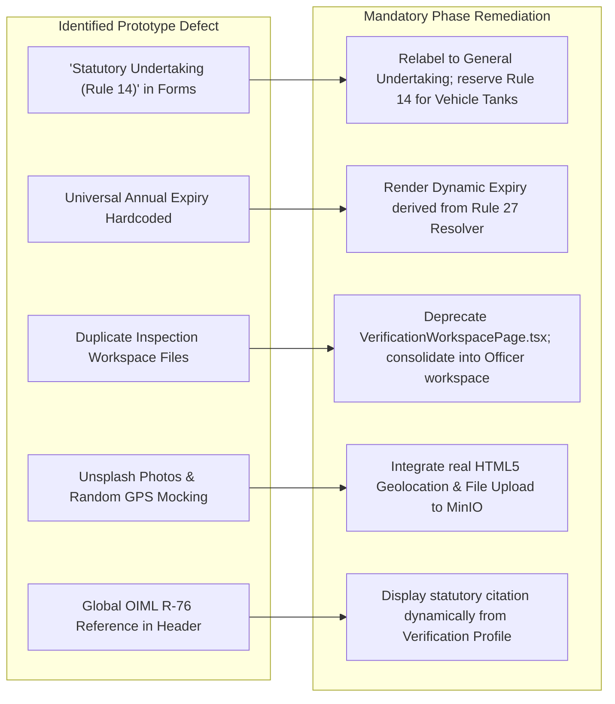

# PERIMETER: Product & UI/UX Design System Specification
## Experience Design, Role Journeys, Component Architecture & Frontend Audit

---

### Document Control
- **Document ID**: DESIGN-PERIMETER-2026-V1.0
- **Version**: 1.0.0
- **Status**: DESIGN SYSTEM SPECIFICATION & AUDIT
- **Target Event**: Smart India Hackathon (SIH) 2026

---

### 1. Design Philosophy & Visual System

PERIMETER is conceived as a national-scale, mission-critical government portal combining administrative authority with state-of-the-art digital ergonomics. It avoids generic bureaucratic austerity in favor of a modern, reassuring, and responsive aesthetic.

```
       Trust & Authority               Modern Accessibility             Frictionless Field Work
  [Deep Ash Blue / Deep Navy]      [Crisp Inter / Outfit Typography]     [High Contrast Field Modes]
               │                                   │                                  │
               └───────────────────────────────────┼──────────────────────────────────┘
                                                   │
                                                   ▼
                                ┌────────────────────────────────────┐
                                │     PERIMETER Experience Core      │
                                └────────────────────────────────────┘
```

#### Core Color Palette (Tailwind Tokens)
- **Primary Brand / Authority**:
  - `Deep Navy`: `#123F63` / `#16466F` (Primary text, official headers, active brand badges)
  - `State Blue`: `#1E75AC` / `#2F8FCC` (Interactive elements, primary CTAs, active steppers)
- **Neutral Backgrounds & Canvas**:
  - `Warm Parchment`: `#F7F3EA` (Page canvas evoking official paper and legibility)
  - `Clean Surface`: `#FFFFFF` (Card surfaces, data tables, modals)
  - `Border Neutral`: `#E8E3D9` / `#CFE5F5` (Subtle dividers and structural borders)
- **Statutory Status Tokens**:
  - `Verified / Pass`: `#36B37E` (Active statutory compliance, authentic badges)
  - `Warning / Expiring`: `#D99A32` (Within 30-day reverification window)
  - `Alert / Fail / Revoked`: `#D95C59` (Exceeded MPE tolerance, broken seal, expired certificate)
  - `Provisional`: `#8C68C8` (Legacy instrument pending physical resolution)

---

### 2. Comprehensive Audit of Existing React Prototype

A detailed architectural inspection of the `src/` codebase reveals an extensive prototype shell with 25+ views. Below is the uncompromised audit of existing screens and their technical/legal fidelity:

#### 2.1 Existing Views Catalog

| Subsystem | Page / Component File | Current Implementation State | Architectural / Legal Defect |
| :--- | :--- | :--- | :--- |
| **Public** | `LandingPage.tsx` | UI Complete (Static) | Claims universal annual renewal across landing cards. |
| **Public** | `PublicCertificateVerifyPage.tsx` | Interactive (Mock Service) | Displays unmasked merchant names and addresses; validates against in-memory array. |
| **Public** | `StartInspectionPage.tsx` | Form UI Complete | Misrepresents application as officer inspection start. |
| **Auth** | `LoginPage.tsx` & `SignUpPage.tsx` | Interactive (Mock LocalStorage `DEMO_MODE` + Backend Ready) | Role-switching dropdown sets simulated JWT in `localStorage` strictly demarcated as `DEMO_MODE`. Backend NestJS JWT authentication & RBAC endpoints implemented (`authService.ts` provides `loginWithBackend`, `registerWithBackend`, `fetchProfileFromBackend`). Full UI migration scheduled for Phase 9. |
| **Business** | `UserDashboardPage.tsx` | Metrics & Charts Complete | Feeds from `mockDashboard.ts`; contains erroneous "Rule 14" point-of-sale notice. |
| **Business** | `MyInstrumentsPage.tsx` | Filterable Table Complete | Backed by in-memory `mockInstruments.ts`. |
| **Business** | `MyInstrumentDetailPage.tsx` | Detail Cards & Stepper Complete | Hardcoded lifecycle history; fake seal IDs. |
| **Business** | `MyApplicationsPage.tsx` | Application List Complete | Reads `applicationsState`. |
| **Business** | `NewApplicationModal.tsx` | Multi-step Modal Complete | Contains erroneous **"Statutory Undertaking (Rule 14)"** checkbox. |
| **Officer** | `OfficerDashboardPage.tsx` | KPI Metrics & Task List | Mock assigned inspections. |
| **Officer** | `OfficerInspectionsPage.tsx` | Assignment Table | In-memory filtering. |
| **Officer** | `OfficerInspectionWorkspacePage.tsx` | Form Checklist & Submission | Hardcodes **OIML R-76**; hardcodes 1 Unsplash image; fake submission alert. |
| **Verification**| `VerificationWorkspacePage.tsx` | Duplicate Workspace (669 lines) | **DUPLICATE FILE**. Contains `alert('...Section 24')`; random GPS coordinate simulation. |
| **Admin** | `AdminDashboardPage.tsx` | High-level charts | Mock aggregated data. |
| **Admin** | `ApplicationsPage.tsx` | Admin management | In-memory assignment logic. |
| **Admin** | `OfficersPage.tsx` | Directory view | Mock officer workloads. |
| **Admin** | `ReportsPage.tsx` | Exportable analytics | Client-side mock CSV export. |
| **Common** | `LifecycleStepper.tsx` | Visual Stepper Component | Hardcoded static step titles and dates. |

---

### 3. Critical UI & Legal Conflicts Requiring Remediation



1. **Rule 14 Mislabeling**:
   - *Current Code*: `src/components/applications/NewApplicationModal.tsx` (Line 529) states: `<p className="font-semibold text-[#1E75AC]">Statutory Undertaking (Rule 14)</p>`.
   - *Fix*: Remove "Rule 14" from this generic business declaration. Rule 14 strictly governs calibration of vehicle tanks under the Ninth Schedule.
2. **Hardcoded Annual Renewal**:
   - *Current Code*: `certificateService.ts` adds 1 year (`nextYear.setFullYear(today.getFullYear() + 1)`).
   - *Fix*: Connect to Rule 27 engine (24 months for counter scales, beam scales, fuel dispensers).
3. **Duplicate Workspace Consolidation**:
   - *Current Code*: `OfficerInspectionWorkspacePage.tsx` and `VerificationWorkspacePage.tsx` duplicate inspection logic.
   - *Fix*: Unify into a single, modular Guided Inspection component driven by backend Verification Profiles.
4. **Section 24 Misquotation**:
   - *Current Code*: `VerificationWorkspacePage.tsx` alerts that Section 24 mandates detailed failure reasons.
   - *Fix*: Remove statutory miscitation; handle rejection reasons via administrative due process standards.
5. **Privacy Protection on Public QR View**:
   - *Current Code*: `PublicCertificateVerifyPage.tsx` displays full owner name, location, and serials.
   - *Fix*: Mask private data (e.g., `R******r P*****r`, `Indore, MP`, masking street address and mobile numbers).

---

### 4. Role-Specific User Journeys

#### 4.1 Business / Instrument Owner Journey
```
[Login / SSO]
      ↓
[Dashboard: View Expiring Instruments (Alerts 30/60 Days)]
      ↓
[Onboard Instrument] ── (Damaged Plate?) ──► [Legacy Provisional Flow: Upload Photos]
      │                                                     │
      └─────────────────────┬───────────────────────────────┘
                            ▼
      [Apply for Verification (Initial / Periodic)]
                            │
      [Select Preferred Slot & Pay Statutory Fee]
                            ▼
      [Track Status: Under Review → Scheduled → Inspected]
                            ▼
      [Inspection Outcome: PASS] ───────────► [Inspection Outcome: FAIL]
                            │                               │
                            ▼                               ▼
      [View Digital Certificate & Download QR]    [File Dispute / Request Re-test]
```

#### 4.2 Legal Metrology Officer (LMO) Field Journey
```
[Secure Login (MFA / Device ID)]
      ↓
[Field Dashboard: Today's Assigned Queue]
      ↓
[Select Assigned Application & Arrive at Geofence]
      ↓
[Validate Working Standards: Select Certified Weight Box #WB-MP-042]
      ↓
[Step 1: Visual & Seal Inspection]
      ↓
[Step 2: Zero & Eccentricity Test] ──► Real-time Delta vs Seventh Schedule MPE
      ↓
[Step 3: Load Progression (0.1 kg → 30 kg)] ──► Real-time Pass/Fail Indicator
      ↓
[Capture High-Res Photo Evidence & Lead Seal #MP-IND-XXXX]
      ↓
[Apply Digital Signature & Finalize Evidence Capsule]
      ↓
[System Signs, Appends Audit Hash Chain & Issues Certificate Instantly]
```

#### 4.3 Public Verification User Journey
```
[Citizen Scans QR Code on Scale at Local Store]
      ↓
[Opens Instant Mobile Web View (No Login Required)]
      ↓
[Verifies Authenticity: Green Checkmark 'VERIFIED UNDER LEGAL METROLOGY ACT, 2009']
      ↓
[Inspects Masked Spec: Max 30kg, Class III, Valid Until: 24-Sep-2028]
      ↓
(If Expired / Fake) ──► [One-Tap 'Report Tampered / Expired Instrument' to State Controller]
```

---

### 5. UI Screen States & Design Requirements

#### 5.1 Empty States
Every list view (My Instruments, Assigned Inspections, Applications, Certificates) must provide an informative empty state featuring:
- Role-specific contextual iconography.
- Explanatory copy clarifying why no items are present.
- Single unambiguous primary action button (e.g. *"Register Your First Instrument"*).

#### 5.2 Loading & Skeleton States
- Discontinue fullscreen spinner blocking.
- Implement animated skeleton pulses matching the card/table layout to prevent layout shift (CLS < 0.1).

#### 5.3 Legal Warning & State Banners
- **Provisional Identity Banner**: Purple background warning that the instrument holds provisional status pending physical officer stamping.
- **Impending Expiry Banner**: Amber alert badge indicating instrument verification expires within 30 days. Commercial operation beyond this date violates Section 24.
- **Revocation / Seizure Alert**: High-contrast red banner with statutory reference for revoked certificates.

#### 5.4 Offline Mobile State Indicator (Phase 9 Bridge)
- Sticky top banner: *"Offline Mode Active — 3 Inspections Cached Locally. Auto-syncing once connection restores."*
