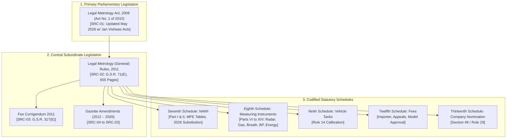

# PERIMETER: Legal Metrology Domain Rulebook & Statutory Source of Truth
## Comprehensive Statutory Codification, Gazette Corpus Ingestion, Schedule Mapping & Rule Engine Specifications

---

### Document Control
- **Document ID**: RULES-PERIMETER-2026-V2.0
- **Version**: 2.0.0 (Post-Corpus Ingestion Baseline)
- **Status**: RATIFIED STATUTORY BASELINE
- **Statutory Authority**: Ministry of Consumer Affairs, Food and Public Distribution, Government of India
- **Corpus Ingestion Scope**: 20 Official Legal Documents (1,514 Pages Total)

---

### 1. Statutory Source Inventory & Provenance

The legal engine of PERIMETER is grounded in the authoritative legal corpus of India. Under no circumstances may frontend code, assumptions, or secondary models override these verified source documents.



---

### 2. Legal Model & Temporal Rule Lifecycle

Legal rules evolve across time through Gazette notifications. A static database of rules is legally invalid:
- Historical verifications must be replayed against the exact rules active on the date of inspection.
- Gazetted rules with future transition dates must NOT be applied prematurely.
- Omitted or repealed rules must be retired from active calculation.

```
       Gazette Notification Published
                     │
                     ▼
       ┌───────────────────────────┐
       │        FUTURE RULE        │ ── [Statutory Effective Date Reached] ──┐
       │ (e.g. Energy Meters 2026) │                                         │
       └───────────────────────────┘                                         ▼
                                                       ┌───────────────────────────┐
                                                       │        ACTIVE RULE        │
                                                       │  (Authoritative for Live) │
                                                       └─────────────┬─────────────┘
                                                                     │
                                                   [Amended / Substituted / Omitted]
                                                                     │
                                                                     ▼
                                                       ┌───────────────────────────┐
                                                       │      SUPERSEDED RULE      │
                                                       │    (Audit Replay Only)    │
                                                       └───────────────────────────┘
```

#### Rule Operational States
1. **`ACTIVE`**: In full statutory force. Drives live applications, guided field inspections, and certificate validity calculations.
2. **`FUTURE`**: Officially gazetted but with a future commencement date (e.g., G.S.R. 809(E) Energy Meters). **Strictly blocked** from active verification execution.
3. **`SUPERSEDED`**: Replaced or substituted by a subsequent gazette amendment (e.g. historical Rule 27(2)(a) 1-year validity). Retained permanently for **Verification Replay**.
4. **`OMITTED`**: Formally omitted from the statute books by gazette amendment (e.g. Rules 16, 21, and 21A omitted by G.S.R. 175(E) in March 2026).
5. **`CORRIGENDUM`**: Typographical or numerical rectifications published in the Gazette (e.g. G.S.R. 317(E) correcting Twelfth Schedule fees).
6. **`REQUIRES LEGAL REVIEW`**: Ambiguous, incomplete OCR, or unresolved legal conflict requiring departmental confirmation.

---

### 3. Exhaustive Statutory Codification Inventory

---

#### R-ACT-001: Verification & Re-verification Mandate
- **Rule ID**: `R-ACT-001`
- **Source ID**: `SRC-01` (`Legal Metrology act,2009.pdf`)
- **Legal Reference**: Legal Metrology Act, 2009, Section 24(1), (2), (3)
- **Status**: `ACTIVE` | **Effective From**: 2011-04-01 | **Effective Until**: Indefinite
- **Jurisdiction**: National
- **Instrument Category**: All commercial weights and measures used for transaction or protection.
- **Requirement**: No person shall use, or have in possession for use, any weight or measure in any transaction or for industrial production or protection, unless it has been verified and stamped by a Legal Metrology Officer.
- **Implementation Mapping**: Enforces verification requirement checks in `WorkflowModule`. Unverified or expired instruments cannot be selected for commercial billing.
- **Confidence**: `100%` | **Review Status**: `VERIFIED`

---

#### R-ACT-002: Company Director & Branch Nomination
- **Rule ID**: `R-ACT-002`
- **Source ID**: `SRC-01` & `SRC-07` (`239353_1732709948.pdf`)
- **Legal Reference**: Legal Metrology Act, 2009, Section 49 read with General Rules 2011, Rule 29 (Amended by G.S.R. 763(E))
- **Status**: `ACTIVE` | **Effective From**: 2022-10-04 | **Effective Until**: Indefinite
- **Jurisdiction**: National
- **Requirement**: Where a company has different establishments, branches, or units, an officer who has the authority and responsibility for planning, directing, and controlling activities may be nominated to be in-charge and responsible. Form 1 in Thirteenth Schedule must record this nomination.
- **Implementation Mapping**: `AuthModule` & `BusinessModule` capture nominated branch officer details for enterprise accounts.
- **Confidence**: `100%` | **Review Status**: `VERIFIED`

---

#### R-GEN-011: Place of Verification
- **Rule ID**: `R-GEN-011`
- **Source ID**: `SRC-06` (`LM_General_Amendment_Rules2021_1732709906.pdf`)
- **Legal Reference**: Legal Metrology (General) Rules, 2011, Rule 11 (Substituted by G.S.R. 149(E))
- **Status**: `ACTIVE` | **Effective From**: 2021-03-03 | **Effective Until**: Indefinite
- **Requirement**:
  1. Verification shall be carried out at the office or laboratory of the Legal Metrology Officer, or at the place of manufacture or import, or at the place of installation.
  2. All non-automatic weighing instruments (NAWI) of capacity **up to 50 kg** shall be verified at the place of manufacture or import, or at a local testing facility.
  3. Weights/measures that cannot be transported without dismantling (e.g. weighbridges, storage tanks) must be verified at the place of installation.
- **Implementation Mapping**: `AuthorityResolverModule` checks instrument capacity and mobility to decide whether verification occurs at a government office/GATC lab or on-site.
- **Confidence**: `100%` | **Review Status**: `VERIFIED`

---

#### R-GEN-013: Statutory Schedule Mapping
- **Rule ID**: `R-GEN-013`
- **Source ID**: `SRC-02` (`6_0_1732709495.pdf`)
- **Legal Reference**: Legal Metrology (General) Rules, 2011, Rule 13
- **Status**: `ACTIVE` | **Effective From**: 2011-04-01 | **Effective Until**: Indefinite
- **Requirement**:
  - All **weighing instruments** shall be verified in accordance with the provisions of the **Seventh Schedule**.
  - All **measuring instruments** shall be verified in accordance with the provisions of the **Eighth Schedule**.
- **Implementation Mapping**: Primary routing key in `VerificationProfileResolver`.
- **Confidence**: `100%` | **Review Status**: `VERIFIED`

---

#### R-GEN-014: Calibration & Verification of Vehicle Tanks
- **Rule ID**: `R-GEN-014`
- **Source ID**: `SRC-02` (`6_0_1732709495.pdf`)
- **Legal Reference**: Legal Metrology (General) Rules, 2011, Rule 14 & Ninth Schedule
- **Status**: `ACTIVE` | **Effective From**: 2011-04-01 | **Effective Until**: Indefinite
- **Instrument Category**: Vehicle tanks, bulk liquid compartments, proving tanks.
- **Requirement**: Vehicle tanks and storage tanks shall be calibrated, verified, and stamped strictly in accordance with the procedures and proving measures specified in the **Ninth Schedule**.
- **CORRECTION OF PROTOTYPE**: Replaces the erroneously fabricated "Statutory Undertaking (Rule 14)" in `NewApplicationModal.tsx`. Rule 14 strictly governs tank calibration.
- **Implementation Mapping**: `VerificationModule` provides dedicated vehicle tank calibration profile.
- **Confidence**: `100%` | **Review Status**: `VERIFIED`

---

#### R-GEN-016-OMIT: Deregulation of Non-Standard Weight Rules
- **Rule ID**: `R-GEN-016-OMIT`
- **Source ID**: `SRC-18` (`GSR 175(E)_1777015860.pdf`)
- **Legal Reference**: Legal Metrology (General) Third Amendment Rules, 2026, G.S.R. 175(E)
- **Status**: `ACTIVE` (OMISSION) | **Effective From**: 2026-03-12 | **Effective Until**: Indefinite
- **Requirement**: **Rules 16, 21, and 21A are omitted** from the Legal Metrology (General) Rules, 2011.
- **Supersedes**: G.S.R. 668(E) amendments to Rule 16 (SRC-04).
- **Implementation Mapping**: Disable regulatory workflows attempting to enforce omitted Rule 16 or 21 reporting.
- **Confidence**: `100%` | **Review Status**: `VERIFIED`

---

#### R-GEN-027-2025: 24-Month Re-verification Period (2025 7th Amendment)
- **Rule ID**: `R-GEN-027-2025`
- **Source ID**: `SRC-15` (`2025.12.18 Gen Rules 7th Amendment 2 yr verification period_1766504014.pdf`)
- **Legal Reference**: Legal Metrology (General) Seventh Amendment Rules, 2025, G.S.R. 905(E)
- **Status**: `ACTIVE` | **Effective From**: 2025-12-18 | **Effective Until**: Indefinite
- **Supersedes**: Historical 12-month provision in Rule 27(2)(a).
- **Requirement**: In Rule 27, in sub-rule (2), for clause (a), substitute:
  > **"(a) twenty-four months for all weights, capacity measures, length measures, tape, beam scale, counter machine and fuel dispensers (petrol and diesel),"**
- **Non-Amended Instruments**: Weighbridges, electronic scale balances > Class I/II, and complex industrial systems remain on a 12-month (annual) re-verification interval.
- **Implementation Mapping**: Core formula in `CertModule` dynamic validity calculator. Overturns hardcoded 365-day expiry.
- **Confidence**: `100%` | **Review Status**: `VERIFIED`

---

#### R-GEN-027A: Gas Meter Re-verification Intervals
- **Rule ID**: `R-GEN-027A`
- **Source ID**: `SRC-09` (`2025.4.21 Gas Meter General Rules_1746001659.pdf`)
- **Legal Reference**: Legal Metrology (General) Second Amendment Rules, 2025, G.S.R. 242(E)
- **Status**: `ACTIVE` | **Effective From**: 2025-09-01 | **Effective Until**: Indefinite
- **Instrument Category**: Volumetric, turbine, rotary, and ultrasonic gas meters.
- **Requirement**: Re-verification intervals resolved dynamically per Table 1 of Rule 27A (5 years for commercial diaphragms, 10 years for residential ultrasonic).
- **Implementation Mapping**: Gas utility meter re-verification profile resolver.
- **Confidence**: `100%` | **Review Status**: `VERIFIED`

---

#### R-SCH7-P2-NAWI: Non-Automatic Weighing Instruments (Counter Scale)
- **Rule ID**: `R-SCH7-P2-NAWI`
- **Source ID**: `SRC-02` (`6_0_1732709495.pdf`) & `SRC-19` (`Gen_Rules_4th_Amendment_NAWI_Fees_1783336378.pdf`)
- **Legal Reference**: Seventh Schedule, Heading-A, Part II (General Rules 2011 as amended by G.S.R. 568(E), 2026)
- **Status**: `ACTIVE` | **Effective From**: 2026-07-03 | **Effective Until**: Indefinite
- **Instrument Category**: Non-automatic mechanical and electronic counter machines (Class III).
- **Golden Demo Scale**: Capacity $Max = 30\text{ kg}$, $e = 5\text{ g}$.
- **Verification Tests**:
  1. **Visual & Identity Examination**: Nameplate markings, stamped identification marks, leveling, agate bearings.
  2. **Zero-Load Balance Error**: Error at zero load $\le \pm 0.5e$.
  3. **Eccentricity (Off-Center) Test**: Load $L = 10\text{ kg}$ ($1/3 Max$) placed at 4 quadrants and center. Maximum error must not exceed MPE.
  4. **Increasing & Decreasing Load Test**: Applied with calibrated standard weights at:
     - Min Load ($20e = 100\text{ g}$)
     - $500e = 2.5\text{ kg}$
     - $1/2 Max = 15\text{ kg}$
     - $Max = 30\text{ kg}$
  5. **MPE Allowances (Seventh Schedule Tables)**:
     - $0 \le m \le 2.5\text{ kg}$ ($500e$): $\text{Initial MPE} = \pm 5\text{ g}$; $\text{In-Service MPE} = \pm 10\text{ g}$.
     - $2.5\text{ kg} < m \le 10\text{ kg}$ ($2000e$): $\text{Initial MPE} = \pm 10\text{ g}$; $\text{In-Service MPE} = \pm 20\text{ g}$.
     - $10\text{ kg} < m \le 30\text{ kg}$: $\text{Initial MPE} = \pm 15\text{ g}$; $\text{In-Service MPE} = \pm 30\text{ g}$.
  6. **Standard Weight Substitution Rule (2026 4th Amendment)**:
     - If repeatability error $\le 0.3e$, standard weights can be substituted with constant ballast up to 50% Max.
     - If repeatability error $\le 0.2e$, standard weights can be substituted up to 80% Max.
- **Implementation Mapping**: Direct algorithm for `TestEngineModule` and Golden Demo execution.
- **Confidence**: `100%` | **Review Status**: `VERIFIED`

---

#### R-SCH8-P10-RADAR: Vehicle Speed Measuring Radar
- **Rule ID**: `R-SCH8-P10-RADAR`
- **Source ID**: `SRC-08` (`Radar Equipment Gen Rules Amendment (1)_1746001628.pdf`)
- **Legal Reference**: Eighth Schedule, Part X, G.S.R. 34(E)
- **Status**: `ACTIVE` | **Effective From**: 2025-07-01 | **Effective Until**: Indefinite
- **Instrument Category**: Microwave Doppler radar equipment for vehicle speed enforcement.
- **Requirement**: Beam incidence angle maintained between $15^\circ$ and $30^\circ$. MPE: $\pm 3\text{ km/h}$ for speeds up to $100\text{ km/h}$; $\pm 3\%$ for speeds exceeding $100\text{ km/h}$.
- **Implementation Mapping**: Traffic police enforcement device verification profile.
- **Confidence**: `100%` | **Review Status**: `VERIFIED`

---

#### R-SCH8-P11-GAS: Gas Meters & Volume Converters
- **Rule ID**: `R-SCH8-P11-GAS`
- **Source ID**: `SRC-09` (`2025.4.21 Gas Meter General Rules_1746001659.pdf`) & `SRC-10`
- **Legal Reference**: Eighth Schedule, Part XI, G.S.R. 242(E)
- **Status**: `ACTIVE` | **Effective From**: 2025-09-01 | **Effective Until**: Indefinite
- **Instrument Category**: Diaphragm, rotary displacement, turbine, and ultrasonic gas meters.
- **Requirement**: Mandates strict physical and cryptographic software separation between legally relevant measurement code and non-relevant communications software.
- **Implementation Mapping**: Software hash verification in gas meter profiles.
- **Confidence**: `100%` | **Review Status**: `VERIFIED`

---

#### R-SCH8-P12-MOISTURE: Grain Moisture Meters
- **Rule ID**: `R-SCH8-P12-MOISTURE`
- **Source ID**: `SRC-12` (`Gen Rule- Moisture Meters_1755669735.pdf`)
- **Legal Reference**: Eighth Schedule, Part XII, G.S.R. 525(E)
- **Status**: `ACTIVE` | **Effective From**: 2025-08-04 | **Effective Until**: Indefinite
- **Instrument Category**: Moisture meters used for cereal grains, oilseeds, and pulses in agricultural mandis.
- **Requirement**: MPE evaluated against standard reference air-oven methods: $\pm 0.4\%$ moisture content on verified samples.
- **Implementation Mapping**: Mandi procurement scale and moisture meter inspection profile.
- **Confidence**: `100%` | **Review Status**: `VERIFIED`

---

#### R-SCH8-P13-BREATH: Evidential Breath Analyzers
- **Rule ID**: `R-SCH8-P13-BREATH`
- **Source ID**: `SRC-14` (`Gen Rules 6th Amendment Breath Analyser_1764862018.pdf`)
- **Legal Reference**: Eighth Schedule, Part XIII, G.S.R. 875(E)
- **Status**: `ACTIVE` | **Effective From**: 2025-11-28 | **Effective Until**: Indefinite
- **Instrument Category**: Breath alcohol analyzers used by law enforcement agencies.
- **Requirement**: 237-page statutory standard specifying physiological conversion factor ($2100:1$), breath volume threshold ($\ge 1.2\text{ L}$), and MPE: $\pm 0.020\text{ mg/L}$ for concentrations $< 0.400\text{ mg/L}$.
- **Implementation Mapping**: Police forensic laboratory verification profile.
- **Confidence**: `100%` | **Review Status**: `VERIFIED`

---

#### R-SCH8-P14-ENERGY: Active Electrical Energy Meters (STAGED AS FUTURE)
- **Rule ID**: `R-SCH8-P14-ENERGY`
- **Source ID**: `SRC-20` (`LM_Gen_Rules_Energy_Meters_1789967396.pdf`)
- **Legal Reference**: Eighth Schedule, Part XIV, G.S.R. 809(E)
- **Status**: `FUTURE` | **Effective From**: 2027-04-01 (Phased) | **Effective Until**: Indefinite
- **Instrument Category**: AC static and smart electrical energy meters (Classes 0.2S, 0.5S, 1, 2).
- **CRITICAL STATUTORY ENFORCEMENT**: Gazette notification published 15th September, 2026, but possesses an explicit future commencement transition period.
- **Rule Engine Behavior**: Blocked from live verification. System flags attempts to verify smart meters as *"Rule Staged for Future Commencement (April 2027)"*.
- **Confidence**: `100%` | **Review Status**: `VERIFIED - STAGED AS FUTURE`

---

#### R-SCH12-FEES: Statutory Verification & Appeal Fees
- **Rule ID**: `R-SCH12-FEES`
- **Source ID**: `SRC-02`, `SRC-03` (`G.S.R. 317(E)`), and `SRC-19` (`G.S.R. 568(E)`)
- **Legal Reference**: Twelfth Schedule, General Rules 2011 (Amended 2011 and 2026)
- **Status**: `ACTIVE` | **Effective From**: 2026-07-03 | **Effective Until**: Indefinite
- **Requirement**:
  - Importer registration fee: Rs. 100 (Corrigendum G.S.R. 317(E)).
  - Appeal fee to Controller: Rs. 200; to State/Central Govt: Rs. 500 (G.S.R. 317(E)).
  - Model approval / Manufacturer statutory fee (Sl No. 2): **Rs. 50,000** (Revised from Rs. 5,000 by G.S.R. 568(E) in July 2026).
- **Implementation Mapping**: Treasury fee simulation in `WorkflowModule`.
- **Confidence**: `100%` | **Review Status**: `VERIFIED`

---

### 4. Definitive Legal Test Vectors (Zero-Deviation Engine Test Data)

The following test vectors are derived directly from the Seventh Schedule (Part II) and must pass with zero deviation in automated unit tests:

#### Vector TV-001: 30 kg Mechanical Counter Scale – In-Service Pass
- **Instrument**: Counter Machine, Class III, $Max = 30\text{ kg}$, $e = 5\text{ g}$.
- **Verification Type**: In-Service Periodic Re-verification (Seventh Schedule, Part II).
- **Applied Load**: `15.000 kg` ($3000e$, falls in $10\text{ kg} < m \le 30\text{ kg}$ range).
- **Indicated Reading**: `15.018 kg`.
- **Calculated Error**: $E = 15.018 - 15.000 = +0.018\text{ kg} = +18\text{ g}$.
- **Allowable In-Service MPE**: $\pm 30\text{ g}$ ($\pm 6e$).
- **Determination**: **`PASS`** ($|+18\text{ g}| \le 30\text{ g}$).

#### Vector TV-002: 30 kg Mechanical Counter Scale – Severe Error Rejection
- **Instrument**: Counter Machine, Class III, $Max = 30\text{ kg}$, $e = 5\text{ g}$.
- **Verification Type**: In-Service Periodic Re-verification.
- **Applied Load**: `30.000 kg` (Full Max Load).
- **Indicated Reading**: `30.045 kg`.
- **Calculated Error**: $E = 30.045 - 30.000 = +0.045\text{ kg} = +45\text{ g}$.
- **Allowable In-Service MPE**: $\pm 30\text{ g}$ ($\pm 6e$).
- **Determination**: **`FAIL`** ($|+45\text{ g}| > 30\text{ g}$, exceeds tolerance by $+15\text{ g}$; triggers mandatory rejection and seal refusal).

#### Vector TV-003: 30 kg Mechanical Counter Scale – Corner Eccentricity Pass
- **Applied Load**: `10.000 kg` ($1/3 Max$) placed on Corner 1.
- **Indicated Reading**: `10.012 kg`.
- **Calculated Error**: $+0.012\text{ kg} = +12\text{ g}$.
- **Allowable In-Service MPE**: $\pm 20\text{ g}$ ($2.5 < m \le 10\text{ kg}$ range).
- **Determination**: **`PASS`** ($|+12\text{ g}| \le 20\text{ g}$).
